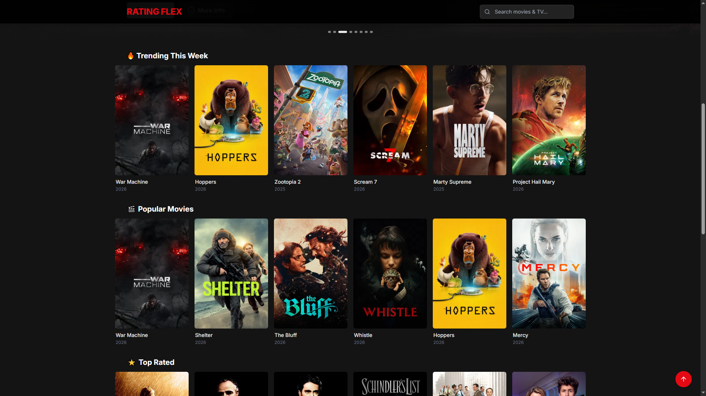
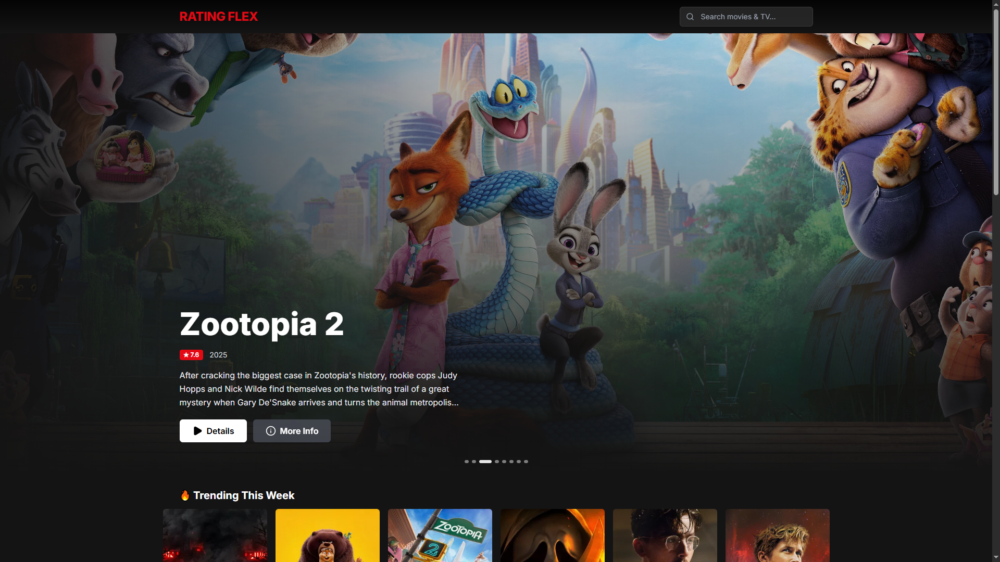
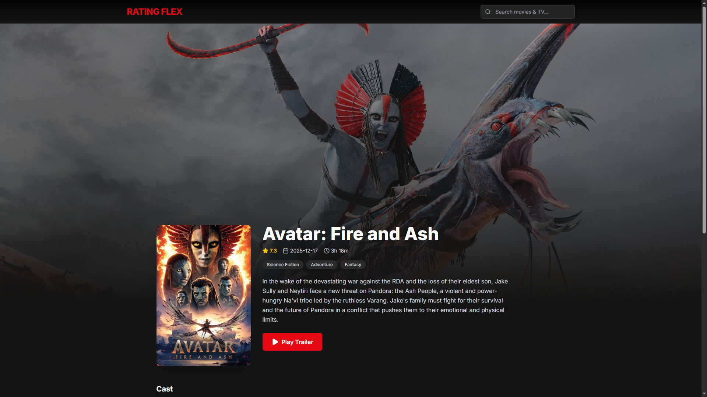
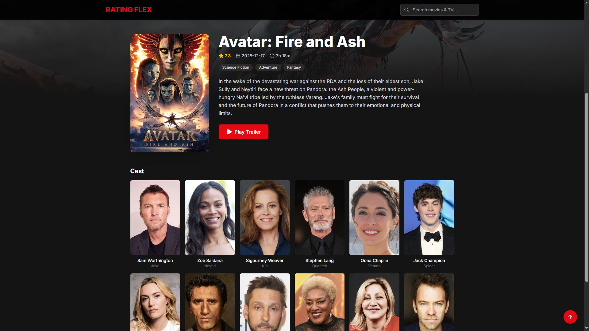
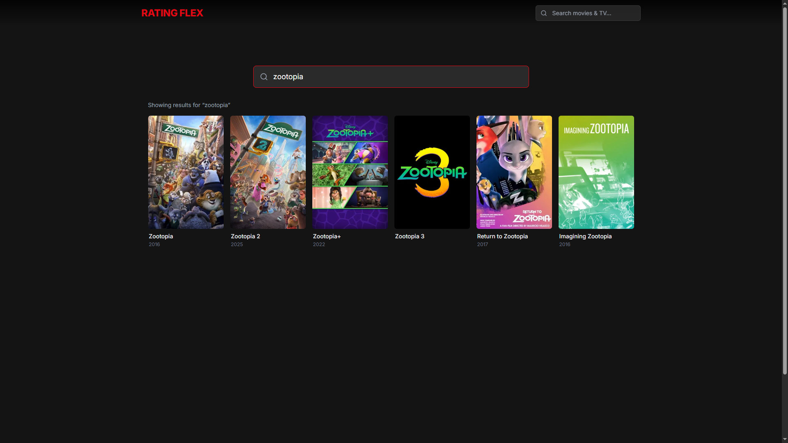

# Rating Flex

Rating Flex is a Netflix-inspired movie discovery platform where users can browse trending titles, explore detailed movie information, and search movies or TV content using The Movie Database (TMDB) API. The project focuses on a modern, responsive UI with smooth interactions and fast client-side navigation.

## Demo

- Live Demo: [Live URL here](https://rating-flex.netlify.app/)

## Screenshots

### Home Page



### Hero Banner



### Movie Details Page




### Search Page



## Features

- Netflix-inspired UI
- Hero banner with auto slider and navigation controls
- Trending movies section
- Popular and top rated movies
- Movie details page
- Cast and trailer support
- Search movies and TV shows
- Responsive design for mobile, tablet, and desktop
- Smooth horizontal scrolling movie rows

## Tech Stack

### Frontend

- React
- Tailwind CSS
- Axios
- React Router

### API

- TMDB API

### UI / Icons

- Lucide Icons

## Folder Structure

```text
src/
	api/
	components/
	pages/
	hooks/
	utils/
	layout/
```

- src/: Main application source code.
- src/api/: API client setup and TMDB endpoint functions.
- src/components/: Reusable UI components (banner, rows, cards, navbar, loaders).
- src/pages/: Route-level pages (home, search, movie details).
- src/hooks/: Custom React hooks for shared data fetching/state logic.
- src/utils/: Utility helpers (image URL builders, formatting helpers).
- src/layout/: Shared layout wrappers and app-level structure.

## API Reference

Rating Flex consumes TMDB endpoints including:

- Trending Movies
- Popular Movies
- Top Rated Movies
- Movie Details
- Search API

## Future Improvements

- User authentication
- Watchlist feature
- Movie ratings by users
- Infinite scrolling
- Dark/light theme toggle

## Author

Author: Pritom Jyoti Talukdar

